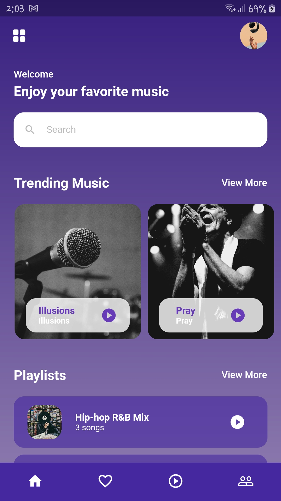
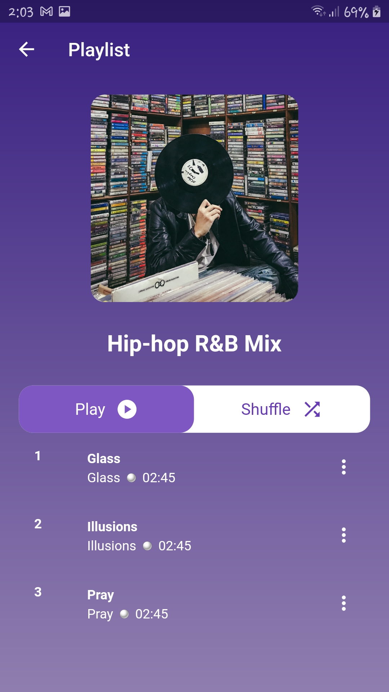
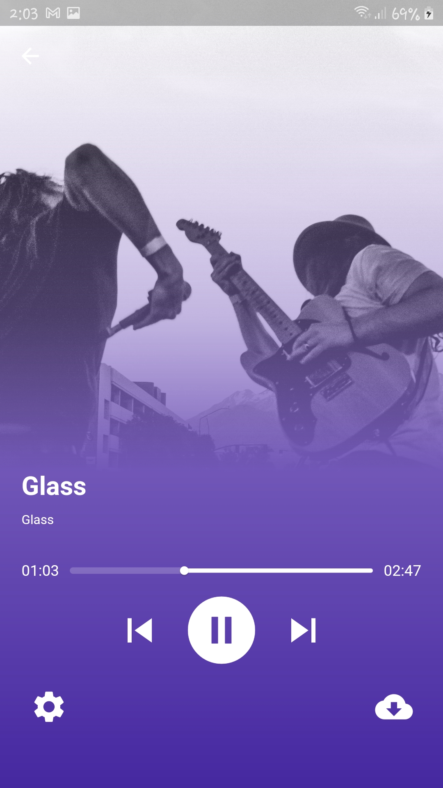

# music_app

# Screenshots:

<h3> 1- Home screen </h3>

  

<h3> 2- Playlist screen </h3>

  

<h3> 3- Song screen </h3>

  

<h3> 4- Screen Recorder </h3>

  <video width="320" height="500" controls>
  <source src="Screenshots/video.mp4" type="video/mp4">
Your browser does not support the video tag.
</video>

## Getting Started

This project is a starting point for a Flutter application.

A few resources to get you started if this is your first Flutter project:

- [Lab: Write your first Flutter app](https://docs.flutter.dev/get-started/codelab)
- [Cookbook: Useful Flutter samples](https://docs.flutter.dev/cookbook)

For help getting started with Flutter development, view the
[online documentation](https://docs.flutter.dev/), which offers tutorials,
samples, guidance on mobile development, and a full API reference.
